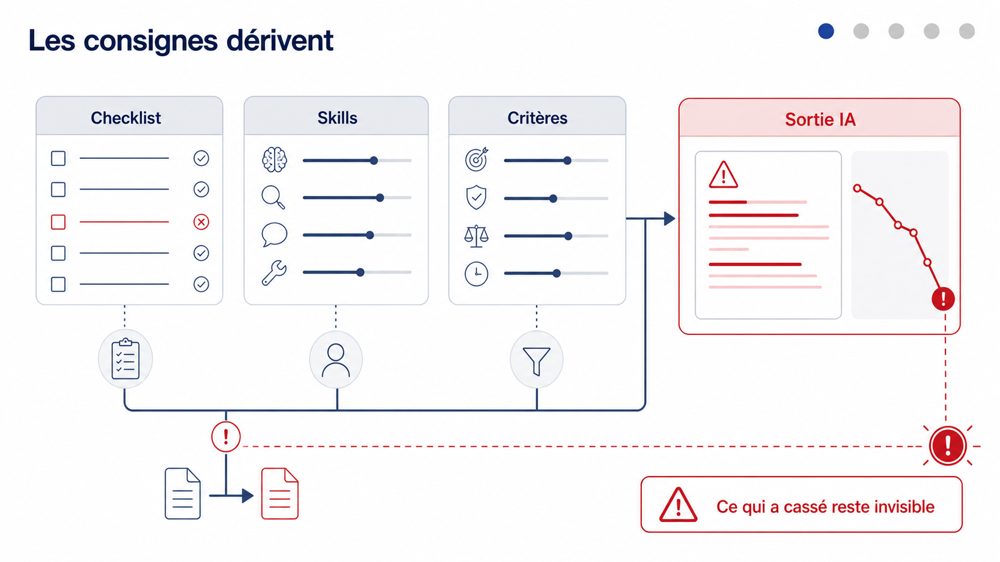
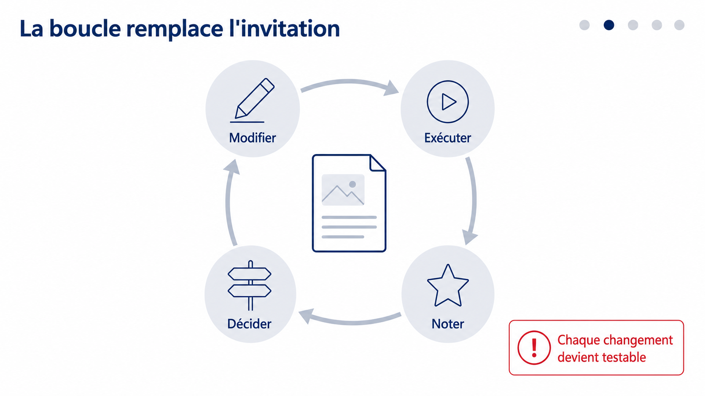
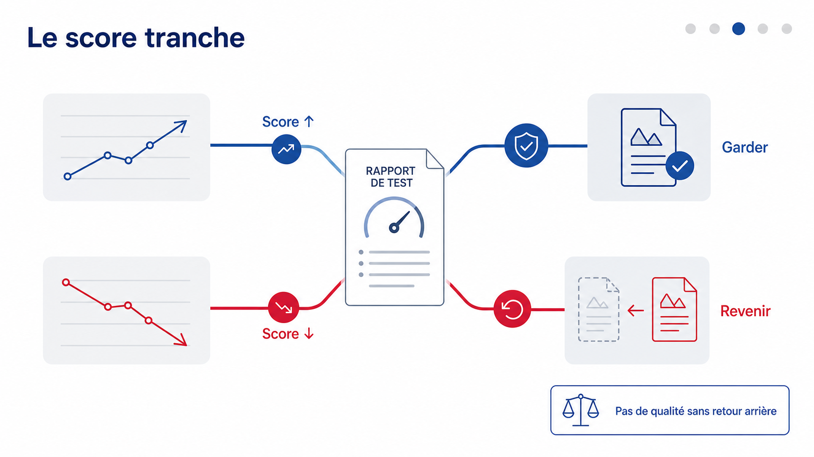
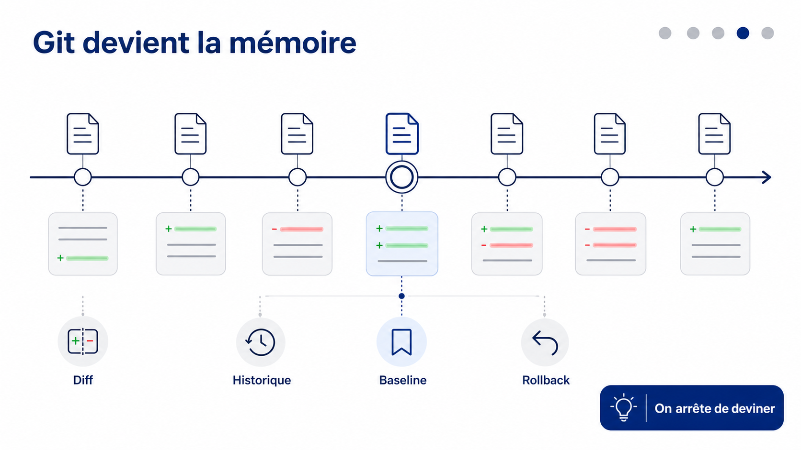
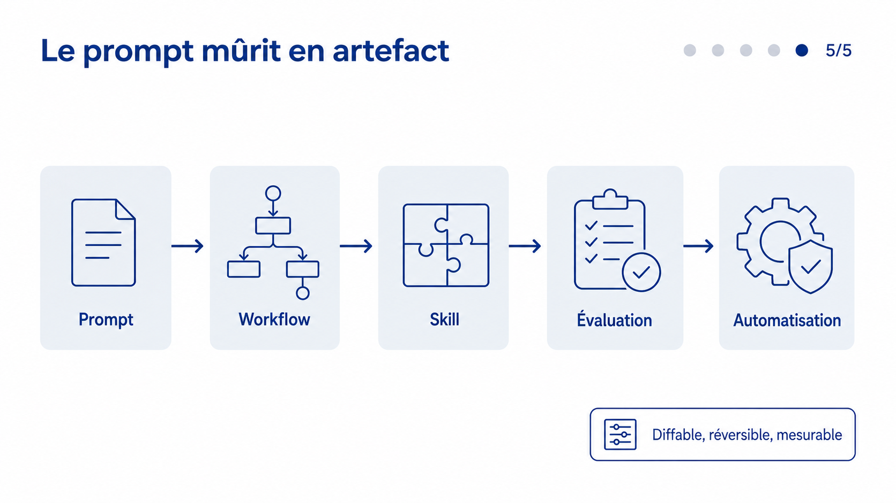
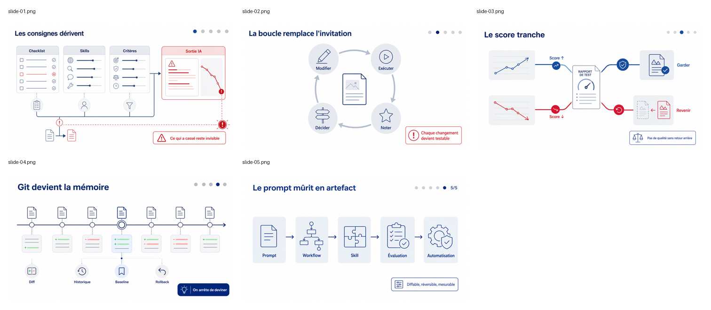

# Application PDS - PM IA et boucles d'agents

Source système appliquée : `../../standalone-system.md`.

## Hypothèses

- Série de 5 slides, car la source expose une boucle complète et un cycle de vie d'artefacts.
- Public cible : PM IA, responsables produit, leads d'équipes outillées par agents.
- Objectif : transformer un texte promotionnel en narration visuelle vérifiable, moins emphatique et plus opérable.
- Rendu effectué ensuite via un adaptateur image ; les artefacts locaux sont copiés dans `assets/`.

## Colonne vertébrale

1. Les instructions IA dérivent sans signal visible.
2. Une boucle qualité rend chaque changement testable.
3. Le score décide : garder ce qui progresse, annuler ce qui casse.
4. Git devient la mémoire diffable de ce qui améliore ou dégrade l'IA.
5. Les prompts utiles mûrissent en artefacts versionnés puis en automatisations.

## Fiches PDS

### slide-01

Rôle dans la colonne vertébrale : poser le problème de dérive.
Idée principale : quand les règles changent souvent, la qualité casse sans alerte claire.
Scène : un tableau de bord de workspace avec checklist, fichier de consignes et jauge de qualité qui décroche.
Personnage ou objet-système : PM IA devant un poste de pilotage.
Transformation visible : état stable -> instruction modifiée -> sortie dégradée.
Texte exact : titre « Les consignes dérivent » ; labels « Checklist », « Skills », « Critères », « Sortie IA » ; callout « Ce qui a cassé reste invisible ».
Masque commun : 16:9, titre haut gauche, frise 1/5, zone centrale en trois panneaux, rouge réservé à la rupture.
Ce que l'image seule doit faire comprendre : le problème n'est pas le prompt isolé, mais l'absence de retour qualité.
Ajout à la slide précédente et préparation de la suivante : ouvre la série et prépare la boucle de contrôle.
Risque à éviter : faire croire que toute évolution hebdomadaire est mauvaise.

### slide-02

Rôle dans la colonne vertébrale : montrer le cycle minimal.
Idée principale : une boucle IA transforme chaque modification en essai mesuré.
Scène : convoyeur circulaire en quatre étapes autour d'un artefact.
Personnage ou objet-système : artefact de travail versionné au centre.
Transformation visible : modifier -> exécuter -> noter -> décider.
Texte exact : titre « La boucle remplace l'invitation » ; labels « Modifier », « Exécuter », « Noter », « Décider » ; callout « Chaque changement devient testable ».
Masque commun : même titre, frise 2/5, bleu pour la boucle, rouge seulement sur l'étape qui échoue.
Ce que l'image seule doit faire comprendre : l'agent n'agit pas une fois, il reproduit un cycle contrôlé.
Ajout à la slide précédente et préparation de la suivante : répond à la dérive par une boucle.
Risque à éviter : représenter une magie autonome sans critères.

### slide-03

Rôle dans la colonne vertébrale : expliciter le mécanisme de décision.
Idée principale : le score arbitre entre conservation et retour arrière.
Scène : deux rails partent d'un rapport de test : vert vers dépôt conservé, rouge vers rollback.
Personnage ou objet-système : système de notation connecté à une sortie IA.
Transformation visible : score en hausse -> garder ; score en baisse -> revenir.
Texte exact : titre « Le score tranche » ; labels « Score ↑ », « Garder », « Score ↓ », « Revenir » ; callout « Pas de qualité sans retour arrière ».
Masque commun : frise 3/5, même grille, bifurcation centrale, rouge uniquement pour régression.
Ce que l'image seule doit faire comprendre : la boucle protège la qualité par comparaison et réversibilité.
Ajout à la slide précédente et préparation de la suivante : rend la boucle gouvernée, puis introduit la mémoire.
Risque à éviter : inventer des métriques ou promettre un score universel.

### slide-04

Rôle dans la colonne vertébrale : installer la mémoire versionnée.
Idée principale : GitHub garde l'historique des formulations qui améliorent ou cassent.
Scène : timeline de commits annotés avec deux états de performance.
Personnage ou objet-système : dépôt partagé comme registre de décisions.
Transformation visible : essais épars -> historique diffable et réversible.
Texte exact : titre « Git devient la mémoire » ; labels « Diff », « Historique », « Baseline », « Rollback » ; callout « On arrête de deviner ».
Masque commun : frise 4/5, timeline horizontale, badges sobres, aucun logo.
Ce que l'image seule doit faire comprendre : le contrôle de version rend l'amélioration traçable.
Ajout à la slide précédente et préparation de la suivante : donne une mémoire à la boucle, puis mène au cycle de vie.
Risque à éviter : dépendre d'une marque ou d'un fournisseur précis dans le visuel.

### slide-05

Rôle dans la colonne vertébrale : conclure sur la maturité des artefacts.
Idée principale : un prompt utile doit devenir un artefact évalué, partagé et automatisable.
Scène : chaîne de maturation avec un prompt qui passe par workflow, skill, évaluation, dépôt et automatisation.
Personnage ou objet-système : artefact IA en progression de maturité.
Transformation visible : copier-coller ponctuel -> asset versionné -> automatisation gouvernée.
Texte exact : titre « Le prompt mûrit en artefact » ; labels « Prompt », « Workflow », « Skill », « Évaluation », « Automatisation » ; callout « Diffable, réversible, mesurable ».
Masque commun : frise 5/5, chaîne gauche-droite, bleu pour maturation, rouge absent.
Ce que l'image seule doit faire comprendre : la valeur durable vient de l'artefact versionné, pas du prompt recopié.
Ajout à la slide précédente et préparation de la suivante : ferme la série sur un modèle opérable.
Risque à éviter : promettre une autonomie totale sans supervision.

## Prompts de rendu

### slide-01

Cas d'usage : visuel de productivité publique. Type d'actif : image finale de slide 16:9 paysage. Demande : créer une slide institutionnelle française sobre, sans faux logo, emblème ni filigrane. Style : fond clair, panneaux gris froids, bleu institutionnel, rouge seulement critique, icônes filaires, aucune 3D. Composition : poste de pilotage PM IA avec trois panneaux « Checklist », « Skills », « Critères » alimentant une zone « Sortie IA » en alerte. Masque commun : titre haut gauche, frise 1/5, zone centrale en trois panneaux, callout bas droit. Storyboard : une règle change, la sortie se dégrade, le signal de rupture devient visible. Texte exact visible : « Les consignes dérivent », « Checklist », « Skills », « Critères », « Sortie IA », « Ce qui a cassé reste invisible ». Contraintes de texte : typographie nette, français correctement accentué, aucun texte ajouté. À éviter : fournisseurs, faux symboles officiels, texte excessif, code long, texte illisible, paragraphe, promesse non prouvée.

### slide-02

Cas d'usage : visuel de productivité publique. Type d'actif : image finale de slide 16:9 paysage. Demande : créer une slide institutionnelle française sobre, sans faux logo, emblème ni filigrane. Style : fond clair, panneaux gris froids, bleu institutionnel, rouge seulement critique, icônes filaires, aucune 3D. Composition : boucle circulaire en quatre étapes autour d'un artefact central. Masque commun : titre haut gauche, frise 2/5, boucle centrale, callout bas droit. Storyboard : l'artefact passe par modification, exécution, notation et décision. Texte exact visible : « La boucle remplace l'invitation », « Modifier », « Exécuter », « Noter », « Décider », « Chaque changement devient testable ». Contraintes de texte : typographie nette, français correctement accentué, aucun texte ajouté. À éviter : fournisseurs, faux symboles officiels, texte excessif, code long, texte illisible, paragraphe, promesse non prouvée.

### slide-03

Cas d'usage : visuel de productivité publique. Type d'actif : image finale de slide 16:9 paysage. Demande : créer une slide institutionnelle française sobre, sans faux logo, emblème ni filigrane. Style : fond clair, panneaux gris froids, bleu institutionnel, rouge seulement critique, icônes filaires, aucune 3D. Composition : rapport de test au centre, deux rails de décision : conservation en bleu, rollback en rouge. Masque commun : titre haut gauche, frise 3/5, bifurcation centrale, callout bas droit. Storyboard : le score augmente et l'artefact est gardé ; le score baisse et le système revient à la version précédente. Texte exact visible : « Le score tranche », « Score ↑ », « Garder », « Score ↓ », « Revenir », « Pas de qualité sans retour arrière ». Contraintes de texte : typographie nette, français correctement accentué, aucun texte ajouté. À éviter : fournisseurs, faux symboles officiels, texte excessif, code long, texte illisible, paragraphe, promesse non prouvée.

### slide-04

Cas d'usage : visuel de productivité publique. Type d'actif : image finale de slide 16:9 paysage. Demande : créer une slide institutionnelle française sobre, sans faux logo, emblème ni filigrane. Style : fond clair, panneaux gris froids, bleu institutionnel, rouge seulement critique, icônes filaires, aucune 3D. Composition : timeline de commits sans marque, avec badges de diff, baseline et rollback. Masque commun : titre haut gauche, frise 4/5, timeline horizontale, callout bas droit. Storyboard : plusieurs essais deviennent un historique diffable qui montre ce qui améliore et ce qui dégrade. Texte exact visible : « Git devient la mémoire », « Diff », « Historique », « Baseline », « Rollback », « On arrête de deviner ». Contraintes de texte : typographie nette, français correctement accentué, aucun texte ajouté. À éviter : fournisseurs, faux symboles officiels, texte excessif, code long, texte illisible, paragraphe, promesse non prouvée.

### slide-05

Cas d'usage : visuel de productivité publique. Type d'actif : image finale de slide 16:9 paysage. Demande : créer une slide institutionnelle française sobre, sans faux logo, emblème ni filigrane. Style : fond clair, panneaux gris froids, bleu institutionnel, rouge seulement critique, icônes filaires, aucune 3D. Composition : chaîne de maturation gauche-droite, chaque étape transforme l'artefact. Masque commun : titre haut gauche, frise 5/5, chaîne centrale, callout bas droit. Storyboard : un prompt isolé devient workflow, skill, évaluation, puis automatisation gouvernée. Texte exact visible : « Le prompt mûrit en artefact », « Prompt », « Workflow », « Skill », « Évaluation », « Automatisation », « Diffable, réversible, mesurable ». Contraintes de texte : typographie nette, français correctement accentué, aucun texte ajouté. À éviter : fournisseurs, faux symboles officiels, texte excessif, code long, texte illisible, paragraphe, promesse non prouvée.

## Reçu de statut

| Slide | Statut | Moteur | Artefact | Ratio | Inspection | Notes |
|---|---|---|---|---|---|---|
| slide-01 | rendered | image-adapter | assets/slide-01.png | 1672x941 | OK | Slide régénérée ; première version rejetée pour progression erronée. |
| slide-02 | rendered | image-adapter | assets/slide-02.png | 1672x941 | OK | Boucle lisible et masque cohérent. |
| slide-03 | rendered | image-adapter | assets/slide-03.png | 1672x941 | OK | Bifurcation score hausse/baisse lisible. |
| slide-04 | rendered | image-adapter | assets/slide-04.png | 1672x941 | OK | Timeline cohérente, sans logo. |
| slide-05 | rendered | image-adapter | assets/slide-05.png | 1672x941 | OK_WITH_NOTE | Mention `5/5` ajoutée, mais cohérente avec la progression finale. |

## Artefacts générés

Artefact rejeté conservé pour traçabilité : `assets/rejected/slide-01-rejected-progress-5of5.png`.

## Contrôles et limites

- Colonne vertébrale : présente, 5 étapes.
- Fiches PDS : complètes pour les 5 slides.
- Prompts : chaque prompt mentionne 16:9, scène, texte exact et interdits.
- Moteur de rendu : `image-adapter`.
- Statuts : 5 slides `rendered`, artefacts présents dans `assets/`.
- Série multi-slides : inspection groupée effectuée via `assets/contact-sheet.png`.
- Limite : inspection visuelle humaine uniquement, sans OCR automatisé.

## Évaluation robuste

Matrice de preuves :

| Affirmation | Source | Verdict | Impact |
|---|---|---|---|
| Le package d'exemple est autonome | Chemins relatifs du dossier | Confirmé | L'exemple peut être partagé sans chemin local. |
| Le prompt standalone impose les sections de sortie | Lecture du markdown source | Confirmé | Le livrable suit l'ordre prescrit. |
| Les deux garde-fous manquants sont pris en compte | Lecture du markdown source | Confirmé | `not_verified` pour rendu faible et inspection groupée nommée. |
| Le contenu source peut tenir en 5 slides | Analyse narrative | Confirmé avec risque faible | 5 étapes couvrent problème, boucle, score, mémoire, maturité. |
| Les images finales sont valides | Fichiers PNG et contact sheet | Partiel | Visuellement cohérent ; OCR automatisé non effectué. |

Score conservateur du livrable après rendu : 90/100.

Points forts :
- narration transformée en cycle visuel concret ;
- réduction de l'emphase initiale au profit d'un modèle opérable ;
- prompts indépendants d'un fournisseur ;
- statuts honnêtes et vérifiables ;
- contact sheet disponible pour contrôler la série.

Risques :
- le sujet reste abstrait et peut produire des visuels de pipeline génériques ;
- la claim « se réparent d'elles-mêmes » doit rester encadrée par score, rollback et supervision ;
- la lisibilité a été inspectée visuellement, mais pas par OCR ;
- les labels sont nombreux sur certaines slides, surtout slide-05.

Amélioration utile avant rendu :
- raccourcir encore slide-05 si le moteur gère mal le texte : retirer « Skill » ou remplacer le callout par trois badges « Diffable », « Réversible », « Mesurable ».

## Passage PDG

Décision : PDG déclenché, car ce document sert de brief de génération réutilisable.

Sources inspectées : prompt standalone homologue, compétence `eval-robuste`, compétence `progressive-disclosure-guard`.

Connus connus : prompt standalone lu ; moteur image générique utilisé ; sortie attendue en six sections.

Connus inconnus : fidélité OCR, conformité textuelle exhaustive, performance sur un autre moteur image.

Inconnus connus : le texte source est promotionnel ; la sortie doit éviter de transformer une formule forte en promesse autonome non prouvée.

Inconnus inconnus : comportement du générateur image face aux accents, flèches et labels courts.

Mauvais chemin d'implémentation : annoncer des slides rendues ou inspectées sans artefact copié dans le test run.

Garde-fou ajouté : la première slide-01 non conforme est conservée en rejet, et la série est inspectée par contact sheet.

Comportement à préserver : indépendance fournisseur, fiche PDS avant prompt, statut honnête.

Raccourcis interdits : faux logo, métriques inventées, backend/studio, promesse d'auto-réparation sans score ni rollback.

Preuve de régression requise : relire la contact sheet, vérifier lisibilité, cohérence du masque et absence de texte parasite.
